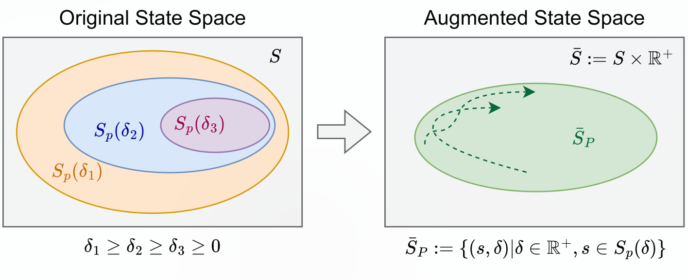

# Beyond Hard Constraints: Budget-Conditioned Reachability For Safe Offline Reinforcement Learning

**Janaka Chathuranga Brahmanage, Akshat Kumar**

[](https://arxiv.org/abs/2603.22292)





## Overview

Real-world applications of Reinforcement Learning (RL) must balance reward maximization with safety constraints. While safety reachability analysis is a promising alternative to unstable min–max optimization, most reachability-based methods address only hard safety constraints rather than cumulative cost constraints.

We propose **Budget-Conditioned Reachability RL (BCRL)**, a novel offline safe RL algorithm that learns a safe policy from a fixed dataset without environment interaction by using dynamic budgets to enforce safety constraints without adversarial optimization.

## Main Contributions

- **Budget-Conditioned Reachability**: A framework that applies reachability analysis to continuous domains with cumulative cost constraints. It uses dynamic budgets to estimate persistently safe state–action sets.
- **Stabilized Learning**: Enforces safety constraints natively without relying on unstable min–max or Lagrangian optimization.
- **Seamless Integration**: Compatible with existing offline RL algorithms (IQL, XQL, SparseQL), requires no generative models or online rollouts, and generalizes to any budget constraint.
- **Empirical Success**: Matches or outperforms state-of-the-art baselines on standard offline safe-RL benchmarks and real-world maritime navigation tasks.

## Usage

### Running BCRL (Deterministic variant)

```bash
python ./bcrl_det.py env_name=<ENV_NAME> seed=<SEED>
```

### Running BCRL (Stochastic variant)

```bash
python ./bcrl_stochastic.py env_name=<ENV_NAME> seed=<SEED>
```

### Example: SafetyGym environments

```bash
for env_name in \
      OfflinePointPush1Gymnasium-v0 \
      OfflinePointPush2Gymnasium-v0 \
      OfflineHopperVelocityGymnasium-v1 \
      OfflinePointCircle2Gymnasium-v0 \
      OfflineCarButton1Gymnasium-v0 \
      OfflineCarButton2Gymnasium-v0 \
      OfflinePointButton1Gymnasium-v0 \
      OfflinePointButton2Gymnasium-v0 \
      OfflineHalfCheetahVelocityGymnasium-v1 \
      OfflineWalker2dVelocityGymnasium-v1 \
      OfflineAntVelocityGymnasium-v1 \
      OfflinePointCircle1Gymnasium-v0 \
      OfflinePointGoal1Gymnasium-v0 \
      OfflinePointGoal2Gymnasium-v0 \
    ; do
  for seed in 0 10 20; do
    echo $env_name seed $seed
    python ./bcrl_stochastic.py env_name=$env_name seed=$seed
  done
done
```

### Example: BulletGym environments

```bash
for env_name in \
      OfflineCarRun-v0 \
      OfflineBallRun-v0 \
      OfflineDroneRun-v0 \
      OfflineAntRun-v0 \
      OfflineBallCircle-v0 \
      OfflineCarCircle-v0 \
      OfflineDroneCircle-v0 \
      OfflineAntCircle-v0 \
    ; do
  for seed in 0 10 20; do
    echo $env_name seed $seed
    python ./bcrl_stochastic.py env_name=$env_name seed=$seed
  done
done
```

### Example: MetaDrive environments

```bash
for env_name in OfflineMetadrive-hardmean-v0; do
  for seed in 0 10 20; do
    echo $env_name seed $seed
    USE_GYMNASIUM=0 python ./bcrl_det.py env_name=$env_name seed=$seed
  done
done
```

> Set `USE_GYMNASIUM=0` for environments that use the legacy `gym` API (e.g. MetaDrive).

## Citation
```
@misc{brahmanage2026hardconstraintsbudgetconditionedreachability,
      title={Beyond Hard Constraints: Budget-Conditioned Reachability For Safe Offline Reinforcement Learning}, 
      author={Janaka Chathuranga Brahmanage and Akshat Kumar},
      year={2026},
      eprint={2603.22292},
      archivePrefix={arXiv},
      primaryClass={cs.LG},
      url={https://arxiv.org/abs/2603.22292}, 
}
```


## Acknowledgements

- Offline safe RL environments and datasets are provided by the [OSRL benchmark](https://github.com/liuzuxin/OSRL).
- Our offline RL implementation is based on [Implicit Q-Learning (IQL)](https://github.com/ikostrikov/implicit_q_learning) ([Kostrikov et al., 2021](https://arxiv.org/abs/2110.06169)), with the JAX implementation adapted from [JAX-CORL](https://github.com/nissymori/JAX-CORL).

## Links

- [Paper (Extended Version)](https://arxiv.org/pdf/2603.22292)
- [Code](https://github.com/janakact/bcrl)
